# 🚀Dokumentasi Proyek Laravel 11

## 📸Hasil Screenshot

### Video 18

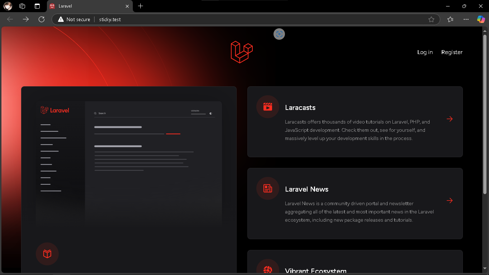  
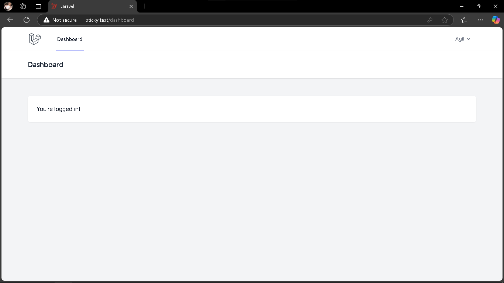  
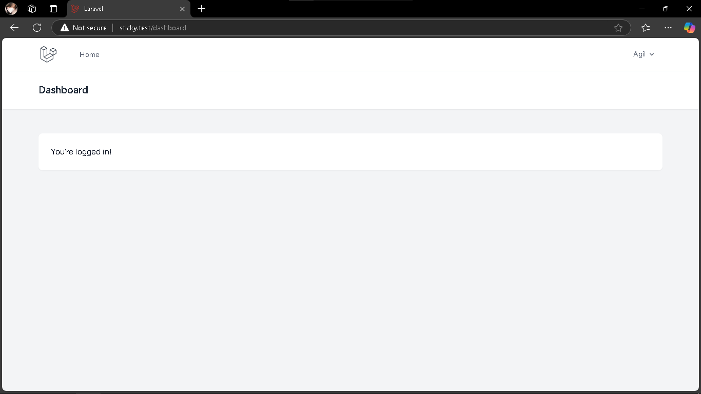  

### Video 19

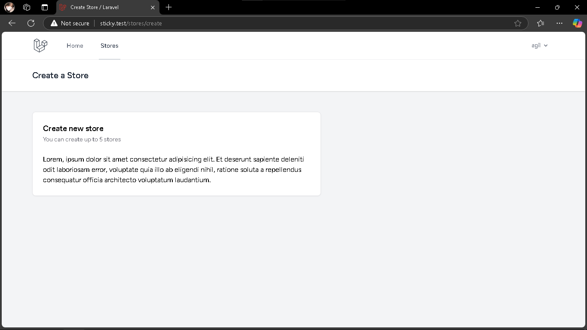   

### Video 20

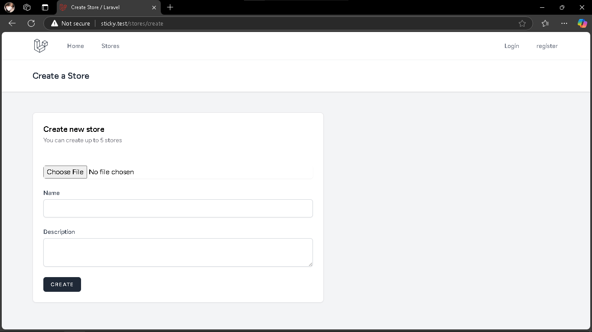  
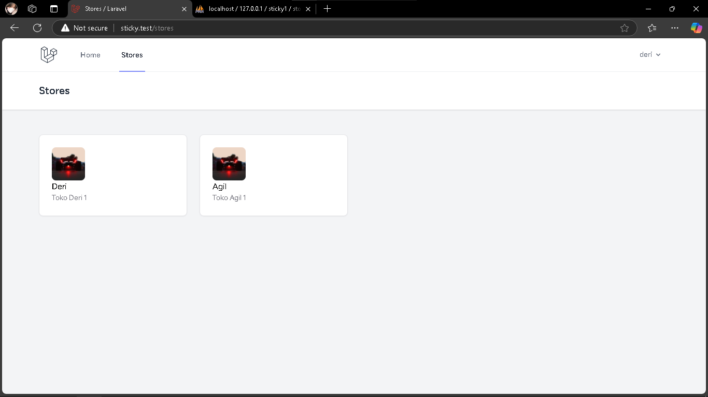   

### Video 21

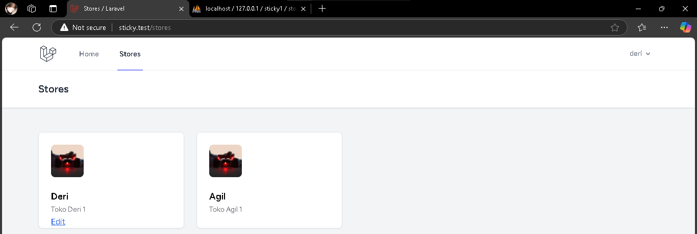  
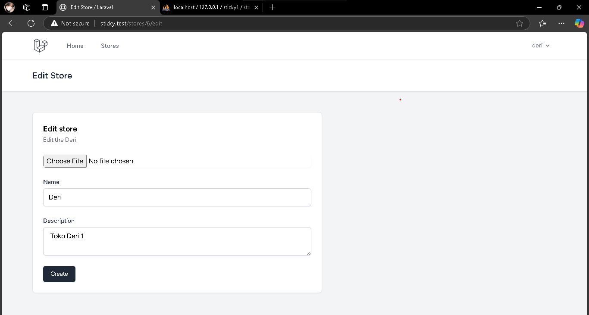  

### Video 22

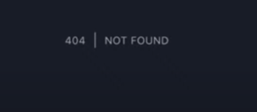  

### Video 23

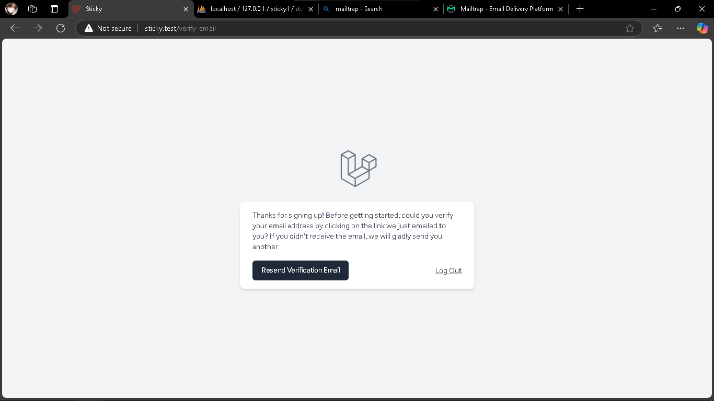  
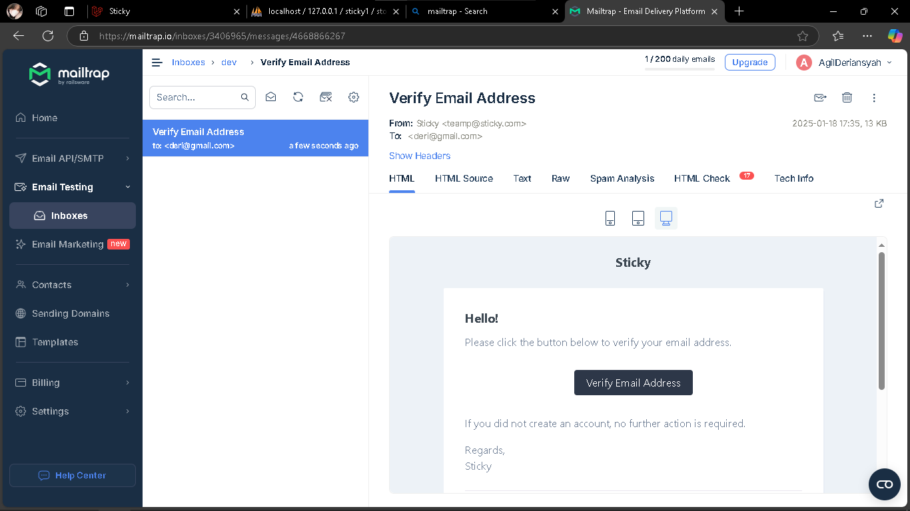  
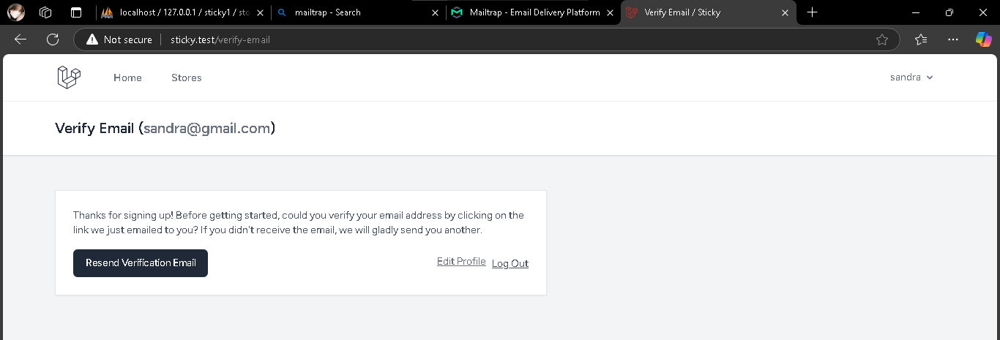  

### Video 24

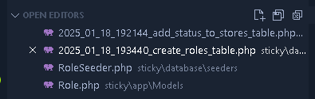  
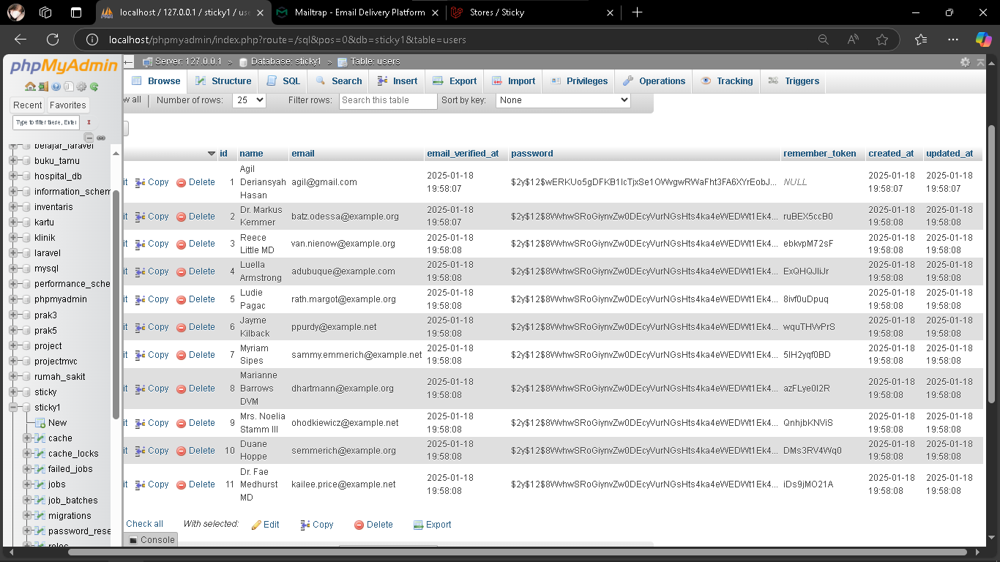  

### Video 25

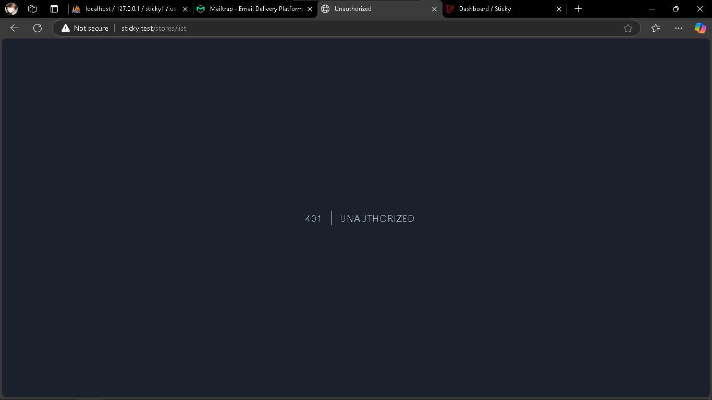  
    

### Video 26

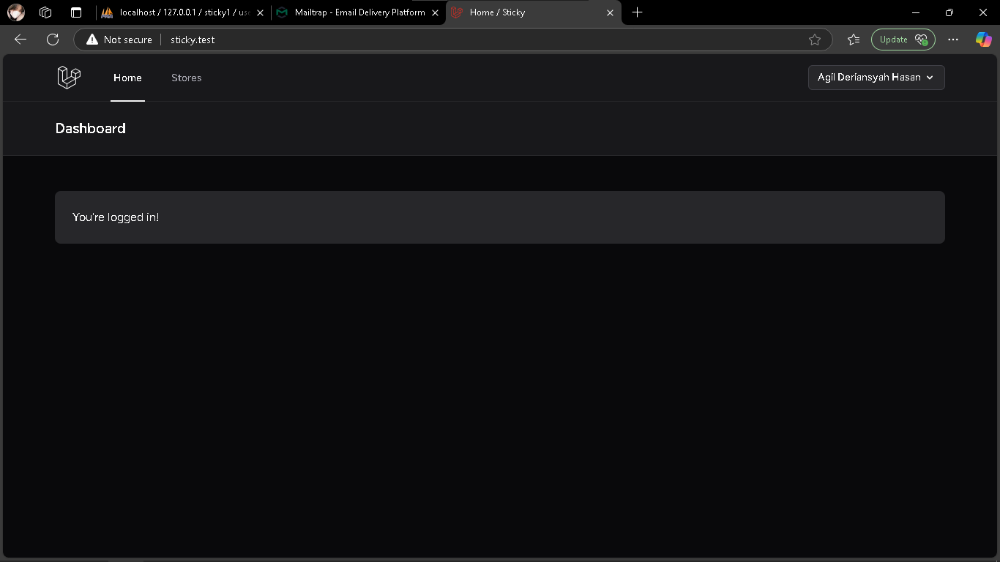   

### Video 27

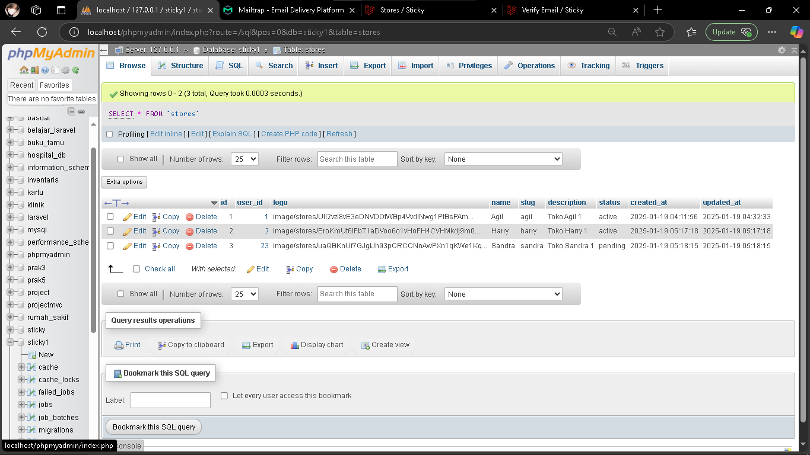  

### Video 28

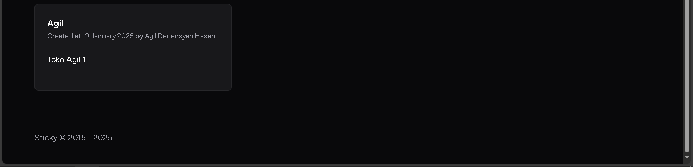  
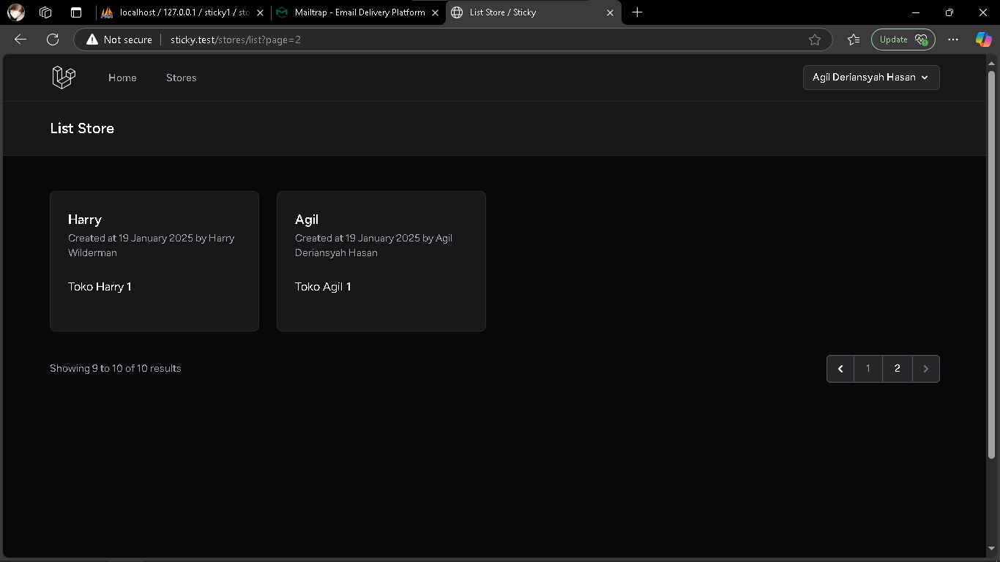  

### Video 29

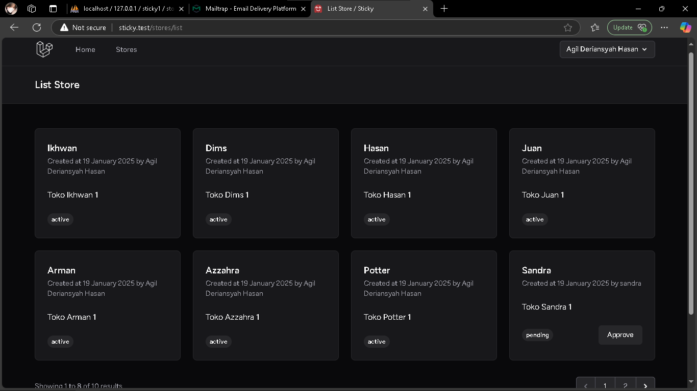  

### Video 30

  

## 👨‍💻Kontribusi

  <b>Agil Deriansyah Hasan</b> 
  <i>4522210125</i>

## 📜Lisensi

Projek ini dilisensikan di bawah [MIT License](LICENSE).